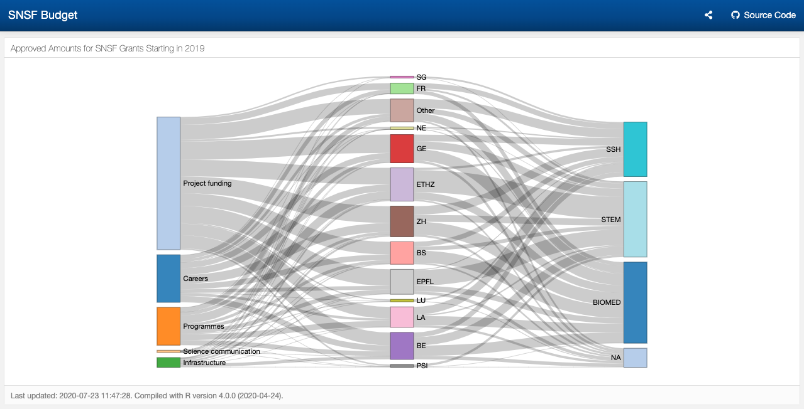

# SNSF Budget

A Sankey Diagram of SNSF Approved Amounts for 2017 Grants, by funding instrument, research institution, and research domain.

Further info:  

* [SNSF funding instruments](http://www.snf.ch/en/funding/selection-guide-for-funding-schemes/overview-of-funding-schemes/Pages/default.aspx)  
* [Swiss Higher Education Institutions](https://www.swissuniversities.ch/en/higher-education-area/recognised-swiss-higher-education-institutions/)  
* [SNSF research disciplines](http://www.snf.ch/SiteCollectionDocuments/allg_disziplinenliste.pdf)

## Data

  - [P3_GrantExport.csv](http://p3.snf.ch/Pages/DataAndDocumentation.aspx) 

## Credits

  - [flexdashboard](https://github.com/rstudio/flexdashboard)  
  - [networkD3](https://christophergandrud.github.io/networkD3/)  
  - [usethis for reporting](https://sharla.party/posts/usethis-for-reporting/)

## License

`snfbudget` is released under the [MIT License](./LICENCE).
